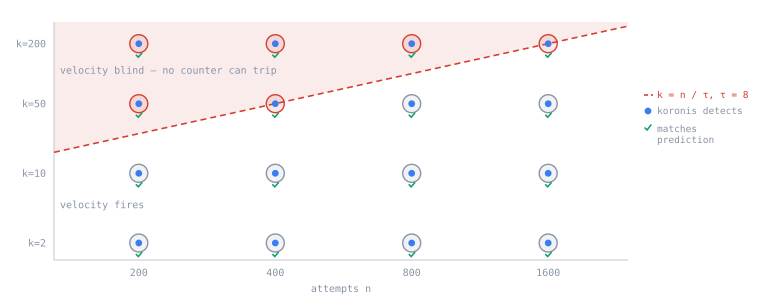

# Koronis

> Detection of distributed card-testing campaigns that per-entity velocity rules cannot see at any threshold.

[](https://github.com/Yashasm18/koronis/actions/workflows/ci.yml)
[](tests/)
[](https://www.python.org/)
[](LICENSE)
[](koronis/models/layers.py)
[](https://razorpay.com/buildathon/)


*Detection, incident consolidation and the cost-optimal action ladder on a held-out
campaign. [Full screen recording (MP4)](docs/assets/koronis-demo.mp4) · run it live at
**[yashasm18.github.io/koronis](https://yashasm18.github.io/koronis/)**.*

## Table of contents

- [Overview](#overview)
- [Key results](#key-results)
- [How it works](#how-it-works)
- [Installation](#installation)
- [Usage](#usage)
- [Evaluation](#evaluation)
- [Limitations](#limitations)
- [Engineering notes](#engineering-notes)
- [Contributing](#contributing)
- [License](#license)
- [Acknowledgements](#acknowledgements)

## Overview

Koronis is a **defence-only detector and decision-support prototype** for one class of
merchant loss: card testing, in which a fraudster runs thousands of micro-transactions
through a checkout to learn which stolen cards are still live. It reports precision and
recall on a held-out test set, false-positive cost in rupees, and detection latency,
because damage accrues from the moment a campaign starts.

Its central contribution is not that the model beats its baselines. It is a
**characterisation of when detection is possible at all**, stated as arithmetic and then
tested: on a 16-point grid, the measured blindness boundary matched the predicted one
16 / 16.

### The problem

A fraudster buys stolen card numbers. Most are dead, so to make money they must learn
which still work: they find a checkout and run ₹1–₹20 charges against each card, and an
approval means the card is live. The merchant's checkout has become a free
card-validation service, and the merchant pays for it — an authorisation fee on every
attempt including declines, card-network penalties when the decline rate spikes, and
chargebacks weeks later on the very cards their site validated.

Existing defences miss the attacks that matter:

- **Velocity rules** were designed for one attacker on one IP. Spread a campaign across
  fifty IPs and forty devices and every counter stays under threshold.
- **Per-transaction models** score each attempt alone, where a real card charged a
  plausible amount looks entirely ordinary.
- **Chargeback-supervised systems** are structurally late: most damage lands before a
  single chargeback is filed.

## Key results

Let an attacker make `n` attempts spread across `k` entities against a counter firing at
threshold `τ`. Attempts per entity are `n/k`, so firing requires `n/k > τ` and an
attacker with `k ≥ n/τ` escapes for any `n`. With counters on several entity types the
engine fires if any trips, so blindness needs `k ≥ n / min(τ)`. Meanwhile the number of
attempt-pairs sharing an entity is `≈ n²/2k`: co-occurrence signal grows as `n²/k` where
per-entity signal is only `n/k`, so the graph's advantage increases with attack size.
The attacker's only escape from the graph is `k → n` — one fresh device, IP and BIN per
attempt — which is bounded by infrastructure cost.

**Predicted vs. measured detectability boundary**, `predicted_boundary_k(n, τ) = n/τ`, on
a 4×4 grid (`python -m koronis.cli frontier`):

| n | k=2 | k=10 | k=50 | k=200 | predicted boundary `n/τ` |
|---:|:---:|:---:|:---:|:---:|---:|
| 200 | fires | fires | **blind** | **blind** | 25 |
| 400 | fires | fires | **blind** | **blind** | 50 |
| 800 | fires | fires | fires | **blind** | 100 |
| 1600 | fires | fires | fires | **blind** | 200 |

The binding threshold is `τ = 8` (the device counter; `τ_ip = 61`, `τ_bin = 236`). Every
cell agrees with `k ≥ n/τ` (**16 / 16**). Koronis detects in all sixteen.



The dashed line is computed from arithmetic before any run. Every measured cell lands on
the side it predicts, and Koronis detects across the whole grid — including the entire
region above the line, where no per-entity counter can trip at any threshold. The chart is
[interactive on the demo site](https://yashasm18.github.io/koronis/); both are generated
from `results/frontier.csv`.

**Held-out detection**, median with the 2.5th / 97.5th percentiles observed across 10
independent trials (`python -m koronis.cli seeds`):

| detector | PR-AUC | precision | recall | false positives | detected |
|---|---:|---:|---:|---:|---:|
| `velocity_tuned` | 0.062 `[0.062, 0.062]` | 0.000 | 0.000 | 44 | 0 / 10 |
| `decline_burst` *(no graph, no learning)* | 0.222 `[0.205, 0.234]` | 0.000 | 0.000 | 0 | 3 / 10 |
| `shared_entity` *(graph, no learning)* | 0.051 `[0.050, 0.051]` | 0.000 | 0.000 | 40 | 0 / 10 |
| `gbdt_per_txn` | 0.332 `[0.311, 0.352]` | 0.410 | 0.836 | 476 | 10 / 10 |
| **`koronis_graph`** | **0.990** `[0.987, 0.995]` | **0.951** | **0.964** | **20** | **10 / 10** |

Threshold rules do not degrade here — they stop working: at `k = 60` against a binding
`τ = 8`, no counter can trip (Claim 1). The per-transaction model detects every time but
at 476 false positives against Koronis's 20, a 24× difference; recall was never the hard
part of this problem, precision at a usable alert volume is. Campaign exposure if never
stopped is ₹29,200; per-trial values are in `results/seeds_raw.csv`.

**Detection latency** — precision / recall using only the stream up to `t` seconds after
onset, each detector held at one calibration-derived threshold at every checkpoint:

| detector | t=60s | t=300s | t=600s |
|---|---|---|---|
| `velocity_tuned` | not detected | not detected | not detected |
| `decline_burst` | not detected | not detected | not detected |
| `shared_entity` | not detected | not detected | not detected |
| `gbdt_per_txn` | P 0.09 / R 0.67 | P 0.35 / R 0.69 | P 0.47 / R 0.75 |
| **`koronis_graph`** | **P 0.43 / R 1.00** | **P 0.82 / R 1.00** | **P 0.88 / R 1.00** |

At one minute Koronis has recalled every campaign attempt so far, at 0.43 precision
against the per-transaction model's 0.09; by ten minutes it is at 0.88 precision with
recall still at 1.00. None of the three learning-free detectors ever crosses its frozen
threshold on this campaign.

## How it works


1. **A graph, not a list.** Every attempt is a node; two attempts are linked when they
   share a device, IP, BIN range or email domain within a time window. Legitimate traffic
   is sparse and scattered; an attack reuses infrastructure somewhere, because
   infrastructure costs money. Edges point **backwards in time** — a node only ever
   aggregates from its own past — so a streaming evaluation cannot read the future.

2. **Score groups, not transactions.** The question becomes "are these attempts one
   coordinated campaign?", which is visible in the structure, rather than "is this payment
   fraudulent?", which is not.

3. **Relational message passing, written from scratch.** No DGL, no PyTorch Geometric;
   aggregation is `torch.index_add_` in [`layers.py`](koronis/models/layers.py):

   ```
   m_v^r = Σ_{u→v} g(x_u, x_v) · W_r x_u / deg(v)
   h_v   = ReLU( W_self x_v + Σ_r a_r · m_v^r )
   ```

   `a_r` is a learned softmax over relations, so the model discovers which entity type
   carries the signal. `g` is a **heterophily gate** scoring each edge from the feature
   difference between its endpoints, because fraud rings deliberately attach to legitimate
   traffic as camouflage and vanilla GNNs assume connected nodes share labels.

4. **Inductive by construction.** No per-entity embedding tables — entity ids only decide
   which events share an edge — so the model scores devices and IPs it has never seen.

5. **Trained on rupees, not cross-entropy.** The business objective is the training
   objective:

   ```python
   p = torch.sigmoid(logits)
   loss = ((1 - p) * labels * c_fn + p * (1 - labels) * c_fp).mean()
   ```

The third-party surface is `numpy`, `pandas`, `scikit-learn`, `lightgbm`, `torch`.

### Where a learned model is deliberately not used

Most of this pipeline is not machine learning, and that is a design decision rather than
an omission. A learned model earns its place only where the quantity is genuinely not
computable in closed form; everywhere else it adds variance, opacity and a training
dependency for nothing.

| Step | What it uses | Why not a model |
|---|---|---|
| Detectability boundary | arithmetic, `k ≥ n/τ` | Derived on paper before any run, then tested. A fitted curve would have described the same fact with less certainty and no explanation. |
| Incident consolidation | union-find over shared entities | "Same incident" *is* connectivity, not similarity. Clustering would impose a distance metric and a `k` on a question that already has an exact answer. |
| Velocity baseline tuning | deterministic threshold search under a stated FP budget | The baseline should be as strong as it can honestly be made, not as weak as a default makes it. |
| Drift detection | Population Stability Index | A standard payments-risk statistic a reviewer can read and re-derive. A learned detector would raise the same flags while making "why" unanswerable. |
| Action selection | `argmin` of expected rupee cost | Four actions with declared costs and a risk estimate — the optimum is a closed-form comparison. A learned policy would need a reward signal that does not exist offline. |

Two places do need learning, because the quantity has no closed form: **relational message
passing with a heterophily gate**, which has to discover which relations carry coordination
against camouflage, and the **conformal quantile forecaster**, which estimates remaining
exposure under uncertainty. Both are measured in [Evaluation](#evaluation), and the
per-relation ablation shows two of the four relations are net-negative — that is the same
discipline applied to the learned half.

## Installation

```bash
python -m venv .venv && .venv/bin/pip install -r requirements.txt
.venv/bin/python -m pytest tests/ -q
```

## Usage

```bash
.venv/bin/python -m koronis.cli ablation      # headline detector comparison
.venv/bin/python -m koronis.cli seeds         # 10 trials, median + across-run range
.venv/bin/python -m koronis.cli frontier      # predicted vs measured boundary
.venv/bin/python -m koronis.cli latency       # precision / recall over time
.venv/bin/python -m koronis.cli mechanism     # which mechanism carries the signal
.venv/bin/python -m koronis.cli relations     # which entity type carries the signal
.venv/bin/python -m koronis.cli incidents     # alerts -> incidents -> forecast -> action
.venv/bin/python -m koronis.cli aperture      # merchant view vs gateway view
.venv/bin/python -m koronis.cli drift         # traffic-profile transfer stress test
.venv/bin/python -m koronis.cli replay        # causal event-by-event replay -> JSON
.venv/bin/python -m koronis.cli benchmark     # p50 / p95 per-event inference latency
```

Results are written to `results/*.csv` and `results/*.json`. Every number in this README
and on the demo site comes from those files. Rebuild the site with:

```bash
python site/build.py       # results/  ->  docs/index.html
```

The page is generated, never hand-edited, so it cannot drift out of step with the
experiment.

## Evaluation

### Protocol

Three splits, and the threshold never sees the test set:

| split | contents | used for |
|---|---|---|
| train | `k ∈ {4, 12, 30}` × `camouflage ∈ {0, 0.5, 1}` | fitting model weights |
| calibration | same distribution as train, different draw | choosing the operating threshold, then frozen |
| test | `k = 60`, `camouflage = 1.0`, unseen entities | reported numbers only |

All three derive from one run seed, so repeating the run resamples every split together.
Training contains only campaigns concentrated enough that a tuned velocity engine still
catches them (`k ≤ 30`, below the `n/τ = 50` boundary at `n = 400`); the test campaign is
spread past that
boundary, fully camouflaged, with unseen entities, so the hold-out is **extrapolation**,
not interpolation. Scores are used raw — rescaling each split by its own maximum would
let every split redefine what a score means.

### Decision layer

Event alerts are not tasks for a fraud team — they are one campaign. Koronis consolidates
them and recommends the intervention with the lowest expected cost, not the one matching
the highest risk score:

```
414 event alerts  →  17 incidents  →  1 action recommended
```

Two concurrent rings stay two incidents: alerts are linked only through entity values
covering under 2% of the whole stream, so sharing `gmail.com` links nothing. Action
figures are declared assumptions about a merchant workflow, in
[`koronis/incident.py`](koronis/incident.py):

| action | friction (genuine) | harm (false) | stops | analyst |
|---|---:|---:|---:|---:|
| monitor | ₹0 | ₹0 | 0% | — |
| rate-limit | ₹120 | ₹400 | 55% | — |
| step-up verification | ₹350 | ₹1,800 | 85% | — |
| hold + review | ₹900 | ₹6,000 | 97% | 12 min |

The chosen action minimises
`friction + risk × forecast_exposure × (1 − stops) + (1 − risk) × false_harm`.

Each consolidated incident carries a plain-text **audit dossier** —
`koronis.incident.dossier()`, also printed by `koronis.cli incidents` and shown in the
console — that reformats the fields already computed (spread and per-entity load,
consolidation, recalibrated risk, the forecast, and the chosen action versus keeping
`monitor`). For the held-out campaign incident:

```
Spread          395 alerted attempts · 60 devices · 60 IPs · 60 BINs
                per-entity load 6.6/device, 6.6/IP, 6.6/BIN  (binding velocity τ = 8)
Consolidation   395 event alerts → 1 incident · link window 900 s
Incident risk   1.000  (recalibrated logistic on calibration incidents)
Forecast        decided after 12 events · remaining P50 309 [P90 557]
                exposure P50 ₹22,584 [P90 ₹40,658]
Recommendation  Hold + analyst review — hold matching attempts, queue for review
                expected ₹1,685  vs ₹22,557 to keep monitoring
                oracle action: hold_review  (matches)
```

### Exposure forecast

Choosing an action needs an estimate of what inaction would cost. Offline that can be read
off the campaign log; a live system cannot, so a policy built on the true remaining count
is an oracle upper bound, not a product. `causal_policy` sees only the first 12 events of
an incident plus a forecast — never the true remaining count or the ground-truth label.

At each incident snapshot a quantile model predicts, from observed signals only, how many
more alerted events will join the incident. That target is deliberately label-free; the
incident risk model answers whether the incident matters, and the policy multiplies the
two:

```
expected remaining exposure  =  P(genuine) × forecast(remaining attempts) × ₹73
```

The upper quantile carries a conformal pad fit on a held-out subset of calibration
incidents; coverage is then evaluated on held-out test incidents. That split is **by
stream, never by snapshot row**, because snapshots of one incident are nested prefixes and
splitting by row inflates apparent coverage (91.8% by row vs. the figure below by stream).

| | measured |
|---|---|
| P90 interval coverage | 96.6% (target 90%) |
| Median absolute error, P50 | 104.0 attempts |
| Mean true remaining | 370.4 attempts |
| Fit / conformal streams | 4 (campaigns 2, 3, 4, 6) / 4 (campaigns 0, 1, 5, 7) |
| Snapshots | 84 calibration / 88 held-out |

The interval over-covers: conservative, which is the safe direction for a policy that
escalates on uncertainty, but not well calibrated with only four conformal streams.
Campaign length is varied across streams for this evaluation — with a fixed length,
"remaining" collapses to a constant minus what you have seen and the forecaster scores a
6.7-attempt median error while learning nothing.

### Policy comparison

Median across 8 independent test streams:

| policy | incidents actioned | false incidents | analyst minutes | merchant cost |
|---|---:|---:|---:|---:|
| always allow | 0.0 | 0.0 | 0.0 | ₹60,444 |
| always hold | 19.5 | 15.5 | 234.0 | ₹121,644 |
| event-by-event thresholding | 2.0 | 1.0 | 214.8 | ₹19,167 |
| **causal policy** *(forecast only)* | 2.0 | 1.0 | 12.0 | ₹16,240 |
| oracle policy *(upper bound)* | 1.5 | 0.0 | 12.0 | ₹8,691 |

Fractional counts are medians across an even number of streams. Not knowing the future is
measured: on the demo stream the causal policy matches the oracle's action on 14 of 17
incidents, for a regret of ₹1,560; across the eight streams the median cost gap is ₹7,548.
Event thresholding reaches the same decision but hands an analyst 214.8 minutes of triage
instead of 12 — consolidation, not detection, is the difference. When the forecast
interval is wide relative to its median, the policy escalates to analyst review rather
than automating.

### Incident-level calibration

An event model with ECE 0.0025 does not give a calibrated incident probability for free —
events inside an incident are strongly dependent, and that dependence is the signal.
Incident risk is a separate model, fitted on 153 calibration incidents pooled across 8
streams and measured on 161 held-out incidents:

| predicted | observed | incidents |
|---:|---:|---:|
| 0.103 | 0.137 | 139 |
| 0.313 | 0.364 | 11 |
| 0.995 | 1.000 | 11 |

Predicted and observed track closely at the top (0.995 → 1.000) and reasonably at the
bottom (0.103 → 0.137, slightly under-confident). The single middle bin (0.313 → 0.364,
11 incidents) is thin; the 0.5–0.7 range holds no incidents at all. Reported rather than
smoothed over.

### Which entity type carries the signal

Dropping each relation in turn and re-fitting under the same protocol (5 trials, medians;
`python -m koronis.cli relations`):

| variant | PR-AUC | precision | recall | false positives | PR-AUC change |
|---|---:|---:|---:|---:|---:|
| all relations | 0.989 | 0.942 | 0.968 | 24 | — |
| **no `bin_id`** | 0.942 | 0.951 | **0.813** | 17 | **−0.047** |
| no `ip_id` | 0.983 | 0.928 | 0.960 | 29 | −0.006 |
| no `device_id` | 0.994 | 0.963 | 0.978 | 15 | +0.005 |
| no `email_domain` | 0.993 | 0.956 | 0.983 | 18 | +0.004 |

Shared BIN ranges carry almost all of it — remove that relation and recall collapses from
0.968 to 0.813. Dropping `device_id` or `email_domain` *improves* PR-AUC and cuts false
positives: they contribute noise, not evidence. This retires an earlier claim based on the
model's per-relation attention weights — attention says where a model looked, not what it
gained. The model is deliberately **not** re-fitted without the two net-negative relations
here; doing that properly means selecting on the calibration split and re-running the full
protocol, which is recorded as the correct next step rather than performed to improve a
headline number.

### Which mechanism carries the signal

Removing each mechanism in turn under the same protocol (5 trials, medians;
`python -m koronis.cli mechanism`):

| variant | PR-AUC | precision | recall | false positives | first alert |
|---|---:|---:|---:|---:|---:|
| **`koronis_full`** | **0.989** | **0.942** | 0.968 | **24** | 0.0 s |
| `no_edges` — event features only | 0.333 | 0.451 | 0.955 | 465 | 0.0 s |
| `no_approved` — graph only | 0.726 | 0.746 | 0.648 | 91 | 67.1 s |
| `no_edges` + `no_approved` | 0.061 | 0.000 | 0.000 | 0 | never |

The authorisation outcome buys earliness (alert at t = 0, but 0.451 precision and 465
false positives). The graph buys precision (first alert moves to 67.1 s and recall drops
to 0.648, but false positives fall to 91 and precision rises to 0.746). Together: 24 false
positives at 0.942 precision, a 19× reduction over event-features-alone; with both removed
the model never fires, so no third signal source is hiding in the features.
`tests/test_first_event.py` pins the structural claim that the opening attempt has zero
campaign-derived links and cannot acquire any.

### Streaming and inference latency

The detector runs as a strictly causal stream: `StreamingKoronis.push(event)` scores one
event at a time and **reproduces batch scores exactly** (asserted to `1e-5` in
`tests/test_stream.py`), which falls out of the backwards-in-time edge rule. Measured over
6,200 events after 200 warm-up, timing only `push`:

| p50 | p95 | p99 | mean | throughput |
|---:|---:|---:|---:|---:|
| 0.99 ms | 1.19 ms | 1.26 ms | 0.98 ms | ~1,018 events/sec |

**Per-event cost is flat in stream length**, by construction:

- **Time** — `O(R · D_max · L · d)` per `push`: `R = 4` relations, `D_max = 32` (the
  `max_degree` fan-in cap in [`graph/build.py`](koronis/graph/build.py), which keeps the
  most recent neighbours), `L = 2` message-passing layers, `d = 32`
  hidden units. None of these depends on the number of events already seen, so measured
  latency holds at ~0.99 ms p50 regardless of stream length.
- **Space** — `O(W · λ · d)`: the `window_s = 3600 s` span times the arrival rate `λ`.
  `bucket.popleft()` evicts events once `t − t_event > W`, so memory tracks active window
  occupancy, not cumulative volume. `test_stream.py::test_window_bounds_memory` asserts
  the buffered total stays well below an unbounded stream's.

On the held-out stream Koronis alerts on the campaign's opening attempt — but that alert
is a declined authorisation with no campaign neighbours yet, weak on its own; the graph is
what makes the following attempts actionable.

### Vantage point: one merchant or the whole gateway

A merchant sees its own checkout. A gateway sees thousands at once, and a
card-testing ring does not confine itself to one of them — spreading across
merchants is simply another axis on which per-merchant counters stay quiet.

The prediction was stated in [`eval/aperture.py`](koronis/eval/aperture.py) before the
run. A campaign of `n` attempts split evenly over `M` merchants leaves `n/M` attempts in
any one merchant's view. Co-occurrence goes as attempts squared over spread, so a single
merchant sees `(n/M)²/k` pairs where the pooled stream sees `n²/k` — about **M times less
signal**. The merchant-scoped view should therefore decay as `M` grows, while the pooled
view sees the stream it would have seen anyway.

Same campaign, same frozen model, same frozen threshold; the only variable is how much of
the stream the detector may see at once (`python -m koronis.cli aperture`):

| merchants | gateway PR-AUC | merchant PR-AUC | gap | largest merchant's share of the campaign |
|---:|---:|---:|---:|---:|
| 1 | 0.999 | 0.999 | **0.000** | 100% |
| 2 | 0.997 | 0.991 | 0.006 | 50% |
| 4 | 0.994 | 0.980 | 0.014 | 27% |
| 8 | 0.988 | 0.947 | 0.041 | 14% |
| 16 | 0.975 | 0.902 | **0.073** | 8% |

**At `M = 1` the two views are the same stream by construction, and they score
identically** — that is the experiment's control, and a test asserts it. From there the
gap opens monotonically and roughly in proportion to `M`, as predicted. Recall tells the
same story: the gateway view holds 0.99 throughout while the merchant view falls to 0.95.

Both views degrade somewhat as `M` grows, because more merchants means more legitimate
traffic and more chances to false-positive; the merchant view degrades about three times
faster. **Honest limit: even at `M = 16` the merchant-scoped view still detects this
campaign.** This measures a widening gap, not a blindness boundary — it says the wider
aperture is worth something and quantifies how much, not that a merchant alone is
helpless.

Entity ids are namespaced per merchant. Without that, two merchants would reuse the same
`d17` and the pooled graph would link strangers — the gateway view would then win on an
artefact. A test asserts no background entity is shared across merchants.

### Traffic-profile transfer stress test

These are synthetic merchant shapes, not real merchants. Surviving this is evidence the
detector is not tuned to one traffic profile; it is not evidence of production
cross-merchant transfer. Everything is fitted on the **base** profile and frozen before
any shifted traffic is scored. The three shifted profiles are declared in
[`koronis/profiles.py`](koronis/profiles.py) before being run:

| profile | what it breaks |
|---|---|
| `subscription` | legitimate device and card reuse is high — dense co-occurrence is normal |
| `marketplace` | entities are diffuse — the graph is sparse and thresholds sit wrong |
| `flash_sale` | a legitimate burst — high volume and elevated declines, no attack |

Drift is measured by Population Stability Index, with the cut-off set to the 95th
percentile of PSI between disjoint base samples:

| profile | median PSI | flagged | largest shift | what changed |
|---|---:|---:|---|---|
| base | 0.141 | 0 / 3 | reuse_bin | — |
| `subscription` | 0.584 | 3 / 3 | reuse_device | ✓ device reuse |
| `marketplace` | 0.924 | 3 / 3 | reuse_ip | ✓ entity diffusion |
| `flash_sale` | 0.400 | 3 / 3 | log_interarrival | ✓ the burst |

Cut-off 0.162. When PSI exceeds it, the policy stands down from automated intervention to
analyst review. That is a trade, not a free win:

| profile | false auto-actions avoided | true responses downgraded | analyst minutes added |
|---|---:|---:|---:|
| `subscription` | 28 | 9 | 312 |
| `marketplace` | 2 | 11 | 60 |
| `flash_sale` | 19 | 9 | 132 |

Across the shifted profiles the guardrail prevents 49 false automated interventions and
downgrades 29 genuine responses, adding 504 analyst minutes.

**Status: experimental decision support, not a safety control.** The cut-off is fitted on
16 base streams and the false-flag rate then measured on 12 disjoint base streams comes
out at 33.3% — too high to run as a default. The reason is a confound, measurable by
holding the merchant fixed at base and varying only the campaign:

| base traffic, merchant held fixed | false-flag rate |
|---|---:|
| campaign matches calibration morphology (`k=30`) | 8.3% |
| background only, no campaign | 16.7% |
| campaign of unseen morphology (`k=60`) | 33.3% |

The signal is substantially detecting the attack, not the merchant. That is an
identification problem, not a tuning bug: live, "different merchant" and "under attack"
cannot be separated before deciding, and the standard fix — monitoring drift on a much
slower timescale than detection — is not implemented here.

## Limitations

Koronis does not identify every fraudulent payment and is not a general fraud model. It
detects coordinated card-testing campaigns where individual events remain ambiguous but
shared infrastructure creates measurable temporal structure. An attacker who uses
genuinely fresh infrastructure for every attempt leaves no graph signal — a real limit,
and also the point of Claim 2: driving `k → n` costs one unit of infrastructure per
attempt.

This is a **semi-synthetic proof of concept**, not production fraud detection.

- **Background traffic is synthetic, and keeping it that way was a measured call.** The
  loader has an IEEE-CIS path ([`background.py`](koronis/data/background.py)) and the real
  dataset was pulled and profiled. In a contiguous slice its native density is ~210
  events/hour (the first 6,000 rows span 28 h); the bootstrap sampler runs at ~1,500
  events/hour *by design*, because thin background was a corrected defect — at low density
  an injected campaign becomes the majority of the traffic in its own window and
  separating it is trivial. Feeding IEEE-CIS in directly reintroduces that regime;
  compressing its timeline to match the density would discard the real inter-arrival
  structure that is the only reason to prefer it. `DeviceInfo` also lives in
  `train_identity.csv` (≈24% row coverage), not `train_transaction.csv`.
- **Campaigns are injected, not observed.** Ground truth exists because it was
  constructed. The hold-out extrapolates to an unseen spread, but this is not the same as
  detecting a campaign in the wild.
- **Cost constants are estimates.** ₹73 per attempt and ₹40 per false block are declared
  in [`cost.py`](koronis/eval/cost.py) with reasoning. Substitute your own and rerun.
- **`money_prevented` assumes detection halts the campaign instantly.** Read it as the
  *cost of latency* — how much more is lost per minute of delay — not guaranteed savings.
- **BIN thresholds are optimistic for the baseline.** Real BIN ranges carry heavy
  legitimate volume, so `τ_bin` would sit far above the 9 measured here, which makes the
  baseline stronger than reality.
- **The drift guardrail is experimental**, as measured above — not a safety control.

### What a production deployment would still need

Stated because the gap between this and a deployed system is itself a design question,
and a reviewer should not have to guess where the seams are.

- **Where it sits.** Koronis is **post-authorisation by construction**: the authorisation
  outcome is one of its two mechanisms, and an outcome exists only after an attempt is
  submitted. It cannot prevent the attempt it learns from — the value is in the attempts
  that follow. A deployment would score inline after auth, where ~1 ms is affordable, and
  feed the decision layer asynchronously.
- **The scorer is causal; the consolidator is not yet.** `StreamingKoronis.push` is
  strictly online and reproduces batch scores exactly. `build_incidents` is not: it
  computes the 2%-link-share cap with `value_counts()` over the whole frame, which is a
  batch quantity. Live, that would need a rolling or decayed frequency estimate. Nothing
  in the reported detection numbers depends on it — it affects consolidation only — but
  it is a real seam between the two halves.
- **No adaptation loop.** The model is fitted once and frozen, which is what makes the
  hold-out meaningful here and is *not* what a deployment wants. Attacks move. A
  production version needs a retraining cadence, analyst dispositions fed back as labels,
  and drift monitored on a far slower timescale than detection — the last of which is
  exactly the confound measured above.
- **Single-merchant scope by default.** The aperture experiment above quantifies what a
  gateway-wide view is worth; running it that way raises data-governance questions this
  prototype does not address.

### Defence-only

Koronis is a detector; the campaign injector exists solely to produce labelled test data.
Every recommended action is decision support in a modelled workflow — nothing blocks a
payment, calls a gateway or touches live infrastructure. There are no real BIN ranges, no
real card numbers, no live endpoints, and no network capability anywhere in the codebase:

```bash
grep -rnE "^(import|from) (requests|urllib|socket|http|aiohttp|subprocess)" koronis/
# no matches
```

It reproduces only attack characteristics already documented publicly in Visa's
anti-enumeration guidance.

## Engineering notes

| path | responsibility |
|---|---|
| [`koronis/data/`](koronis/data/) | Event schema, background loader, campaign injector with `(n, k, camouflage)` control |
| [`koronis/graph/build.py`](koronis/graph/build.py) | Windowed entity-sharing graph, backwards-in-time edges, degree cap |
| [`koronis/models/layers.py`](koronis/models/layers.py) | From-scratch relational message passing |
| [`koronis/models/koronis.py`](koronis/models/koronis.py) | Inductive detector |
| [`koronis/models/loss.py`](koronis/models/loss.py) | Expected-rupee-cost objective |
| [`koronis/models/velocity.py`](koronis/models/velocity.py) | FP-budget-tuned multi-entity baseline |
| [`koronis/eval/`](koronis/eval/) | Cost model, latency harness, calibration, frontier sweep |

### What broke

Every defect below was surfaced by running experiments, not by reading code.

1. **Entity-ID leakage.** Campaign entity ids were named per campaign index, so datasets
   built with different seeds reused the same device fingerprints — train and test shared
   entity identity. Every test passed and the metrics looked excellent, but the model
   could have keyed on entity names rather than structure, making the inductive claim
   false while appearing perfect. It surfaced only because a test *asserted* the
   hold-out's entities were disjoint.

2. **A segfault from import order.** LightGBM and PyTorch each ship an OpenMP runtime; on
   macOS, loading them in the wrong order crashes the interpreter. The package now fixes
   the order before either is reachable.

3. **Train 0.998 / test 0.000.** Trained on a single loud campaign, the model memorised
   micro-amounts instead of coordination. The training distribution now spans both spread
   and camouflage, so coordination is the only invariant available to learn.

4. **The frontier disagreed with its own prediction on 25% of the grid.** Devices and IPs
   were assigned round-robin while BINs used random sampling, and the multinomial maximum
   reached 18 attempts where the mean was 8, tripping a threshold of 9 for reasons
   unrelated to the hypothesis. With uniform spread across every entity, agreement went to
   100%.

5. **A rescaling that quietly changed a published conclusion.** Calibration and test
   scores were each divided by their own maximum before thresholding. No test labels were
   touched, but it let each split redefine what a score of `1.0` meant, so a "frozen"
   threshold referred to a different absolute quantity on each — and the conclusion drawn
   from it was wrong, in the direction that flattered this project.

6. **A simulation that made the problem easy, and three bugs behind it.** The background
   ran at 9 events/hour across thirty days, so an injected campaign was 97% of the traffic
   in its own window. Fixing the density to 1,600 events/hour uncovered three further
   defects the thin traffic had masked: every entity type shared one Zipf draw with a
   clamp, piling the tail onto one id that carried 42% of all traffic; the frontier used
   `max(τ)` as its binding constraint when a multi-entity engine needs `k ≥ n / min(τ)`;
   and the calibration split carried a 37% positive rate under which "alert on every
   event" is genuinely cost-optimal. It also reversed a headline: raw co-occurrence
   counting, previously reported at 0.894 PR-AUC, collapses to 0.055 once legitimate
   traffic is dense enough to co-occur constantly.

7. **Two concurrent rings became one blob.** The incident layer merged two independent
   campaigns into a single 597-attempt incident, bridged entirely by email domain — five
   distinct values across 607 alerts. Restricting links to values covering under 2% of the
   whole stream then over-fragmented the campaign into sixty disjoint cliques, which
   exposed the real cause: the generator assigned devices, IPs and BIN ranges in the same
   round-robin order, so all three partitioned a campaign identically and the relations
   never cross-cut. With independent assignment the campaign forms one connected component
   and two concurrent rings stay two clean incidents. That fix moved a headline — action
   regret against the oracle had been ₹0 on 11/11 incidents, and now it is not.

An inference benchmark reporting p50 1.78 ms was also discarded: it was measured while a
training job ran on the same machine. The idle run is 0.99 ms.

Three lessons, none about neural networks. From (1) and (4): a property you assert in a
test gets checked; a property you merely intend gets silently violated the moment an
unrelated helper changes. From (5): a preprocessing step that seems neutral can decide
your conclusion, and the dangerous ones are those whose bias points your way. From (6):
when a result looks too clean, suspect the simulation before congratulating the model.

## Contributing

[CONTRIBUTING.md](CONTRIBUTING.md) covers development setup and the conventions that keep
the results reproducible — every claim backed by an assertion, every published number
regenerated from `results/`. Security policy and scope: [SECURITY.md](SECURITY.md).

## License

[MIT](LICENSE) © 2026 Yashas.

## Acknowledgements

The Koronis family is a group of asteroids that share orbital elements because they are
fragments of a single shattered parent body. Hirayama found them in 1918 not by looking at
the sky, where they are scattered and unremarkable, but by plotting them in
orbital-element space, where they clump unmistakably. Individually ordinary events,
scattered in the obvious view; plotted in shared-entity space, a common origin becomes
undeniable.

Built for the Razorpay AI Buildathon 2026 · Track 02, AI Risk Manager.
