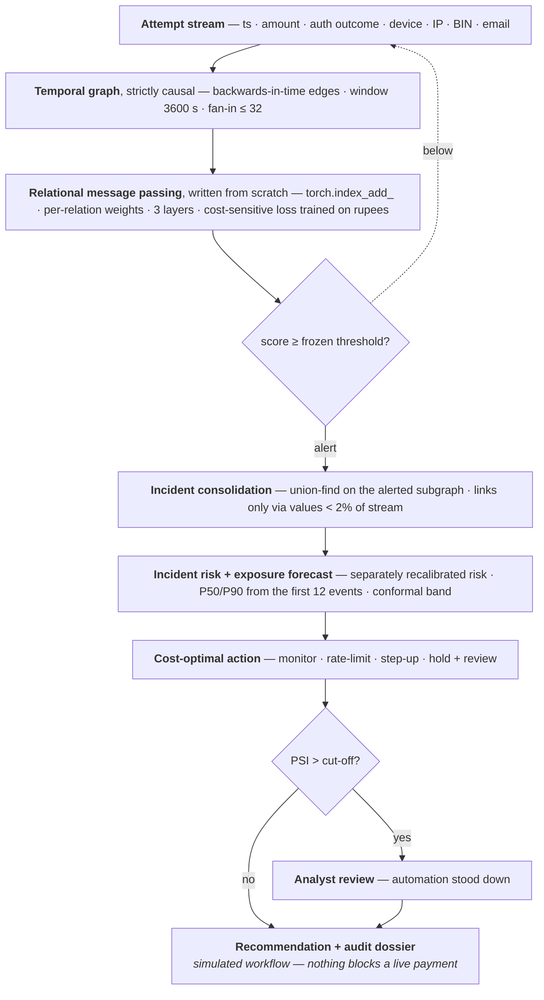
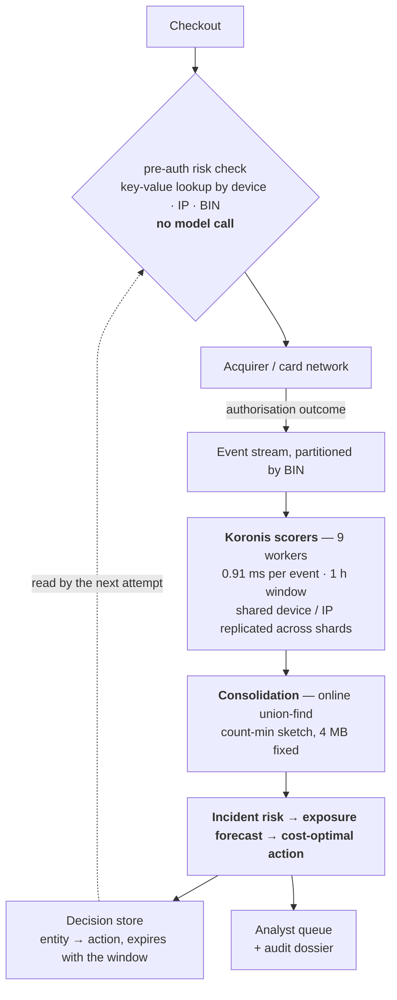

# Koronis

> Detection of distributed card-testing campaigns that per-entity velocity rules cannot see at any threshold.

[](https://github.com/Yashasm18/koronis/actions/workflows/ci.yml)
[](tests/)
[](https://www.python.org/)
[](LICENSE)
[](koronis/models/layers.py)
[](https://razorpay.com/buildathon/)


*Detection, incident consolidation and the cost-optimal action ladder on a held-out
campaign. [Full screen recording (MP4)](docs/assets/koronis-demo.mp4) · run it live at
**[yashasm18.github.io/koronis](https://yashasm18.github.io/koronis/)**.*

## What it solves

**Card testing.** A fraudster pushes thousands of ₹1–₹20 charges through a merchant's
checkout to find which stolen cards are still live. The checkout becomes a free
card-validation service, and the merchant pays: an authorisation fee on every attempt
including declines, network penalties when the decline rate spikes, and chargebacks weeks
later on the cards their own site validated.

**Velocity rules cannot catch it — not because they are tuned badly, but by arithmetic.**
An attacker spreading `n` attempts across `k ≥ n/τ` entities keeps every counter under
threshold at *any* threshold. Koronis is a **defence-only detector and decision-support
prototype** built for exactly that region.

Its contribution is not that it beats its baselines. It is a **characterisation of when
detection is possible at all** — stated as arithmetic, then tested.

```bash
python -m venv .venv
.venv/bin/pip install -r requirements.txt -r requirements-dev.txt
.venv/bin/python -m playwright install chromium   # the site tests drive the demo page
.venv/bin/python site/build.py                    # they need docs/index.html to exist
.venv/bin/python -m pytest tests/ -q              # 220 tests, ~2 min
.venv/bin/python -m koronis.cli ablation          # reproduces the headline table below
```

The suite runs without `requirements-dev.txt` — the eight tests that drive the demo page
skip — but then 212 are collected rather than 220, and the test-count check says so.

## Key results

**Why the graph wins, in one line.** Per-entity signal dilutes as `n/k`, but the number of
attempt-pairs sharing an entity grows as `n²/k` — so the graph's advantage *increases* with
attack size, and the attacker's only escape is `k → n`: one fresh device, IP and BIN per
attempt, bounded by infrastructure cost.

**Predicted vs. measured detectability boundary**, `predicted_boundary_k(n, τ) = n/τ`, on
a 4×4 grid (`python -m koronis.cli frontier`):

| n | k=2 | k=10 | k=50 | k=200 | predicted boundary `n/τ` |
|---:|:---:|:---:|:---:|:---:|---:|
| 200 | fires | fires | **blind** | **blind** | 25 |
| 400 | fires | fires | **blind** | **blind** | 50 |
| 800 | fires | fires | fires | **blind** | 100 |
| 1600 | fires | fires | fires | **blind** | 200 |

The binding threshold is `τ = 8` (the device counter; `τ_ip = 61`, `τ_bin = 236`). Every
cell agrees with `k ≥ n/τ` (**16 / 16**). Koronis detects in all sixteen.


The dashed line is arithmetic, drawn before any run. Every measured cell falls on the side
it predicts, and Koronis detects across the whole grid — including the entire region above
the line, where no per-entity counter can trip at any threshold.

**Held-out detection**, median with the 2.5th / 97.5th percentiles observed across 10
independent trials (`python -m koronis.cli seeds`):

| detector | PR-AUC | precision | recall | false positives | detected |
|---|---:|---:|---:|---:|---:|
| `velocity_tuned` | 0.062 `[0.062, 0.062]` | 0.000 | 0.000 | 44 | 0 / 10 |
| `decline_burst` *(no graph, no learning)* | 0.222 `[0.205, 0.234]` | 0.000 | 0.000 | 0 | 3 / 10 |
| `shared_entity` *(graph, no learning)* | 0.051 `[0.050, 0.051]` | 0.000 | 0.000 | 40 | 0 / 10 |
| `gbdt_per_txn` | 0.332 `[0.311, 0.352]` | 0.410 | 0.836 | 476 | 10 / 10 |
| **`koronis_graph`** | **0.997** `[0.996, 0.999]` | **0.977** | **0.990** | **10** | **10 / 10** |

Threshold rules do not degrade here — they stop working: at `k = 60` against a binding
`τ = 8`, no counter can trip. The per-transaction model detects every time but at **476
false positives against Koronis's 10**. Recall was never the hard part; precision at a
usable alert volume is.

Every part of the architecture producing these numbers was **chosen on the calibration
split**, never by hand: which relations to keep and whether to gate
([eight candidates](docs/evaluation.md#closing-the-loop-selecting-an-architecture-without-touching-test)),
and how large to make it — 32 hidden units and 3 layers,
9,171 parameters, from a
[nine-point width × depth grid](docs/evaluation.md#was-the-model-sized-or-just-chosen).
Test was read once, after each choice was already made.

**Detection latency.** At one minute Koronis has already recalled every campaign attempt
so far, at 0.46 precision against the per-transaction model's 0.09; by ten minutes it is at
0.90 precision with 0.94 recall. None of the three learning-free detectors ever crosses its
frozen threshold on this campaign.
→ [full latency curves](docs/evaluation.md#streaming-and-inference-latency)

**An alert is not a task.** Hundreds of event alerts are one campaign, so Koronis
consolidates them and picks the intervention with the lowest expected rupee cost:

```
402 event alerts  ->  7 incidents  ->  2 actions recommended
```

One test stream, end to end. One of those two actions was wrong — a two-attempt incident
rate-limited when the oracle would have left it alone — and it is the *only* decision in
that stream the oracle would have made differently, so it accounts for the whole of that
stream's ₹520 regret. The policy sees only an incident's first 12 events plus a forecast,
never the true remaining count. The costs below are medians across all 8 test streams:

| policy | analyst minutes | merchant cost |
|---|---:|---:|
| always hold | 126.0 | ₹50,307 |
| event-by-event thresholding | 211.0 | ₹6,602 |
| **causal policy** *(forecast only)* | **12.0** | **₹3,405** |
| oracle *(upper bound, knows the future)* | 12.0 | ₹3,145 |

Event thresholding reaches the same decision and hands an analyst **eighteen times the
triage**. Consolidation, not detection, is the difference. Not knowing the future still
costs — ₹3,405 against the oracle's ₹3,145.

## Architecture



Attempts are nodes; two are linked when they share a device, IP, BIN range or email domain
inside a window. Edges point **backwards in time**, so a streaming evaluation cannot read
the future — which is also what lets the replay reproduce batch scores exactly. Aggregation
is `torch.index_add_`: **no DGL, no PyTorch Geometric**.

The detector is a **temporal heterogeneous graph network**, inductive, trained on expected
rupee cost rather than cross-entropy — the business objective *is* the training objective.
Its relation set and its gate were **selected on calibration**, not chosen by taste.

→ **[Full architecture, and which parts are learned](docs/architecture.md)**

## Where this would run

**This section is a design proposal, not something that has been built.** The numbers in it
are measured; the placement is reasoned. Nothing here talks to a payment system, and no
part of this repository can.

Koronis is **post-authorisation by construction** — it reads the authorisation outcome,
which exists only after an attempt is submitted. It therefore cannot block the attempt it
learns from, and the value is in the attempts that follow. That single fact decides where
it belongs: **the model never sits on the checkout's critical path.**



Scoring consumes the authorisation stream asynchronously. Decisions are written to a
key-value store keyed by entity, and the pre-auth path performs a **lookup** — the same
shape as the velocity counters most gateways already run there.

**Sizing, from measured constants.** At 0.91 ms per event and 1,095 events/sec per worker,
nine workers cover ~9,900 events/sec. Memory is bounded by the window rather than by
traffic history, and the frequency state is fixed at 4 MB regardless of how many distinct
entity values pass through — which matters, because a card-testing campaign mints a fresh
card id per attempt.

**Partitioning is a modelling decision, and it was measured, not assumed.** Splitting a
graph deletes edges. Routing by BIN preserves the relation that
[carries the signal](docs/evaluation.md#which-entity-type-carries-the-signal); replicating
the events whose device or IP actually recurs
[restores recall from 0.72 to 0.99 at eight shards](docs/evaluation.md#recovering-the-edges-a-partition-deletes),
for 2.421× the scoring work. Reported honestly: **every partitioned configuration is worse
than not partitioning at all**, so more workers is a cost to justify, not a free lever.

**What each recommendation maps to.** `monitor` is no action. `rate_limit` throttles the
linked entities. `step_up` is additional verification scoped to the implicated subgraph
rather than to all traffic. `hold_review` queues for a person, with the
[audit dossier](docs/evaluation.md#decision-layer) as the evidence. This is a signal
source for an existing risk stack, not a replacement for one — it covers a single class of
loss that per-transaction scoring provably cannot see above a spread.

**What would have to be true first**, stated plainly: the model is fitted once and frozen,
which is what makes the hold-out honest and is not what a deployment wants; the data is
semi-synthetic, and BIN — the relation carrying most of the signal — is the one whose real
behaviour differs most from the simulation; and any deployment would begin in shadow mode,
scoring and logging without acting, until its false-positive rate had been measured on real
traffic. [Full limitations.](docs/limitations.md)

## Reproducing everything

Every experiment writes to `results/`, and **every number in this repo and on the demo site
is read from there** — nothing is transcribed by hand.

<details>
<summary><b>All experiments</b></summary>

```bash
.venv/bin/python -m koronis.cli ablation        # headline detector comparison
.venv/bin/python -m koronis.cli seeds           # 10 trials, median + across-run range
.venv/bin/python -m koronis.cli frontier        # predicted vs measured boundary
.venv/bin/python -m koronis.cli mechanism       # which mechanism carries the signal
.venv/bin/python -m koronis.cli relations       # which entity type carries the signal
.venv/bin/python -m koronis.cli architecture    # do the gate and the attention earn their place
.venv/bin/python -m koronis.cli online          # online consolidation vs the batch grouping
.venv/bin/python -m koronis.cli sharding        # does the graph survive being split across machines
.venv/bin/python -m koronis.cli replicate       # can replication recover what sharding deletes
.venv/bin/python -m koronis.cli select          # architecture selection on calibration, tested once
.venv/bin/python -m koronis.cli capacity        # width x depth grid, selected on calibration
.venv/bin/python -m koronis.cli aperture        # merchant view vs gateway view
.venv/bin/python -m koronis.cli incidents       # alerts -> incidents -> forecast -> action
.venv/bin/python -m koronis.cli drift           # traffic-profile transfer stress test
.venv/bin/python -m koronis.cli latency         # precision / recall over time
.venv/bin/python -m koronis.cli replay          # causal event-by-event replay -> JSON
.venv/bin/python -m koronis.cli benchmark       # p50 / p95 per-event inference latency
python site/build.py                            # results/ -> docs/index.html
```

</details>

## What is measured, and where

| Question | Answer | Detail |
|---|---|---|
| Does it detect what velocity rules cannot? | 0.997 PR-AUC vs 0.062, on a hold-out spread past the boundary | [Evaluation → protocol](docs/evaluation.md#protocol) |
| What does a false positive cost? | costed in rupees; 10 FPs against a GBDT's 476 | [Evaluation → decision layer](docs/evaluation.md#decision-layer) |
| Which mechanism carries the signal? | outcome buys earliness, the graph buys precision | [Evaluation](docs/evaluation.md#which-mechanism-carries-the-signal) |
| Do the architectural claims hold? | one did not — the heterophily gate was **net-negative**, and selection removed it | [Evaluation](docs/evaluation.md#does-the-architecture-earn-its-place) |
| Was the model sized, or just chosen? | sized — 32×3 selected on calibration from a 9-point grid, and it held up on test | [Evaluation](docs/evaluation.md#closing-the-loop-selecting-an-architecture-without-touching-test) |
| Is a gateway's wider view worth anything? | measured: the gap grows with the number of merchants | [Evaluation](docs/evaluation.md#vantage-point-one-merchant-or-the-whole-gateway) |
| Does it survive a different merchant? | flagged on all three shifted profiles; the guardrail is **experimental** | [Evaluation](docs/evaluation.md#traffic-profile-transfer-stress-test) |
| Can it run online? | 0.91 ms p50; streaming reproduces batch scores exactly | [Evaluation](docs/evaluation.md#streaming-and-inference-latency) |
| Is the *whole* pipeline causal? | yes — consolidation too, via a sliding count-min sketch in fixed memory | [Evaluation](docs/evaluation.md#making-consolidation-causal) |
| Does it survive being split across machines? | measured — and PR-AUC and rupees disagree about which routing is better | [Evaluation](docs/evaluation.md#does-the-graph-survive-being-split-across-machines) |
| Can the loss be recovered? | yes — replication restores recall 0.65 → 0.99 and is the cheapest routing at every shard count | [Evaluation](docs/evaluation.md#recovering-the-edges-a-partition-deletes) |
| What broke? | 16 defects, **4 retracted claims** | [Engineering log](docs/engineering-log.md) |

## Limitations

This is a **semi-synthetic proof of concept**, not production fraud detection.

- **Background traffic and campaigns are generated.** The IEEE-CIS loader exists and the
  real data was profiled, then deliberately not used — its native density would reintroduce
  a defect this project already fixed.
- **It will not catch** an attacker using genuinely fresh infrastructure for every attempt.
  That limit is real, and it is also the point: driving `k → n` costs one device, IP and BIN
  per attempt.
- **Cost figures are declared assumptions**, not measurements.
- **The drift guardrail is experimental** — its false-flag rate on held-out base traffic is
  too high to depend on, and the reason is measured.
- **Defence-only.** No network capability anywhere in the package, no live payment
  integration, no real card or BIN data. Every recommended action is a recommendation in a
  simulated workflow.

→ **[Full limitations, deployment gaps, and scope](docs/limitations.md)** ·
[Security policy](SECURITY.md)

## Documentation

| | |
|---|---|
| [Architecture](docs/architecture.md) | how it works, and where a learned model is and is not used |
| [Evaluation](docs/evaluation.md) | protocol, ablations, calibration, forecasting, drift, latency |
| [Limitations](docs/limitations.md) | what is assumed rather than measured, and what production would need |
| [Engineering log](docs/engineering-log.md) | repository map, and every defect that changed a result |
| [Contributing](CONTRIBUTING.md) | development setup and the conventions that keep results reproducible |

## License

[MIT](LICENSE) © 2026 Yashas.

## Acknowledgements

The Koronis asteroids share orbital elements because they are fragments of one shattered
parent body. Hirayama found them in 1918 not by looking at the sky, where they are
scattered and unremarkable, but by plotting them in *orbital-element space*, where they
clump unmistakably. Individually ordinary events, scattered in the obvious view; plotted in
shared-entity space, a common origin becomes undeniable.

Built for the Razorpay AI Buildathon 2026 · Track 02, AI Risk Manager.
