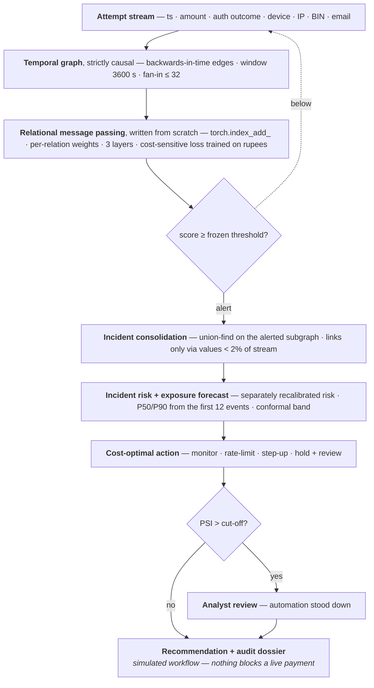

# Architecture

How Koronis is built, and which parts of it are learned.

[← back to the README](../README.md)




1. **A graph, not a list.** Every attempt is a node; two attempts are linked when they
   share a **device, IP or BIN range** within a time window — `MODEL_RELATIONS`. The data
   carries a fourth, `email_domain`, which the detector does not consume: the per-relation
   ablation found it net-negative and calibration removed it, though incident consolidation
   still links on it. [`schema.py`](../koronis/data/schema.py) keeps the two sets apart. Legitimate traffic
   is sparse and scattered; an attack reuses infrastructure somewhere, because
   infrastructure costs money. Edges point **backwards in time** — a node only ever
   aggregates from its own past — so a streaming evaluation cannot read the future.

2. **Score groups, not transactions.** The question becomes "are these attempts one
   coordinated campaign?", which is visible in the structure, rather than "is this payment
   fraudulent?", which is not.

3. **Relational message passing, written from scratch.** No DGL, no PyTorch Geometric;
   aggregation is `torch.index_add_` in [`layers.py`](../koronis/models/layers.py):

   ```
   m_v^r = Σ_{u→v} g(x_u, x_v) · W_r x_u / deg(v)
   h_v   = ReLU( W_self x_v + Σ_r a_r · m_v^r )
   ```

   `a_r` is a learned softmax over relations. It was *intended* to let the model discover
   which entity type carries the signal, and it does not measurably do so: mixing the
   relations uniformly at 1/R instead changes PR-AUC by **0.0000 at every camouflage
   level**. It costs no parameters and earns nothing, and is recorded that way in
   [AI decisions](ai-decisions.md) rather than described as if it worked. `g` is a **heterophily gate** scoring each edge from the feature
   difference between its endpoints — the reasoning being that fraud rings attach to
   legitimate traffic as camouflage, and vanilla GNNs assume connected nodes share labels.
   That reasoning did not survive measurement: the
   [architecture ablation](evaluation.md#does-the-architecture-earn-its-place) finds the gate
   net-negative at two layers and within noise at the three that calibration selected, while
   **depth** is the component that actually earns its place — dropping to two layers costs
   0.0010 PR-AUC at full camouflage.

4. **Inductive by construction.** No per-entity embedding tables — entity ids only decide
   which events share an edge — so the model scores devices and IPs it has never seen.

5. **Trained on rupees, not cross-entropy.** The business objective is the training
   objective:

   ```python
   p = torch.sigmoid(logits)
   loss = ((1 - p) * labels * c_fn + p * (1 - labels) * c_fp).mean()
   ```

The third-party surface is `numpy`, `pandas`, `scikit-learn`, `lightgbm`, `torch`.

### What learns, and what does not

Most of this pipeline is not machine learning, and that is a design decision rather than
an omission — but the halves are worth stating side by side, because the placement *is*
the engineering.

**Where learning earns its place.** Each of these estimates a quantity with no closed
form, and each is measured rather than asserted:

| Component | What it learns | Measured in |
|---|---|---|
| Relational message passing ([`layers.py`](../koronis/models/layers.py)) | a per-relation transform of each neighbour's state — the coordination signal itself, which nothing else in the pipeline can compute | [per-relation ablation](evaluation.md#which-entity-type-carries-the-signal) — BIN carries it (removing it costs 0.0281); `email_domain` is net-negative and was dropped; device and IP move PR-AUC within noise but cost false positives when removed |
| Heterophily gate `g(x_u,x_v) = σ(W·abs(x_u−x_v))` | which edges to damp, intended for camouflage edges into legitimate traffic | [architecture ablation](evaluation.md#does-the-architecture-earn-its-place) — net-negative at two layers, **within noise at three**; selected out on calibration either way. Off by default, code retained behind `use_gate` |
| Depth — 3 relational layers | coordination that survives camouflage reaches further than two hops | [capacity sweep](evaluation.md#was-the-model-sized-or-just-chosen) — depth dominates width; three layers chosen on calibration |
| Cost-sensitive objective ([`loss.py`](../koronis/models/loss.py)) | a decision boundary in rupees, not in cross-entropy | false-positive counts in [held-out detection](../README.md#key-results) |
| Incident risk — L2 logistic, fitted by gradient descent | whether a *consolidated incident* is genuine; event calibration does not transfer, because events inside one are dependent | [incident-level calibration](evaluation.md#incident-level-calibration) |
| Quantile regression + split conformal ([`forecast.py`](../koronis/forecast.py)) | how many attempts remain, and an interval it can defend | [exposure forecast](evaluation.md#exposure-forecast) — 95.3% coverage against a 90% target |

**Where a learned model is deliberately not used.** A model earns its place only where the
quantity is genuinely not computable in closed form; everywhere else it adds variance,
opacity and a training dependency for nothing.

| Step | What it uses | Why not a model |
|---|---|---|
| Detectability boundary | arithmetic, `k ≥ n/τ` | Derived on paper, then implemented and checked. Under the generator's uniform spread the grid agreeing with it is exact by construction, so this is an implementation check rather than a tested prediction. A fitted curve would have described the same fact with less certainty and no explanation. |
| Incident consolidation | union-find over shared entities | "Same incident" *is* connectivity, not similarity. Clustering would impose a distance metric and a `k` on a question that already has an exact answer. |
| Velocity baseline tuning | deterministic threshold search under a stated FP budget | The baseline should be as strong as it can honestly be made, not as weak as a default makes it. |
| Drift detection | Population Stability Index | A standard payments-risk statistic a reviewer can read and re-derive. A learned detector would raise the same flags while making "why" unanswerable. |
| Action selection | `argmin` of expected rupee cost | Four actions with declared costs and a risk estimate — the optimum is a closed-form comparison. A learned policy would need a reward signal that does not exist offline. |

The per-relation ablation applies the same discipline to the learned half: one of the four
relations turns out to be net-negative and was dropped, and two more move the headline
metric by less than trial-to-trial noise. That is reported rather than quietly rounded into
a story about every relation pulling its weight.
